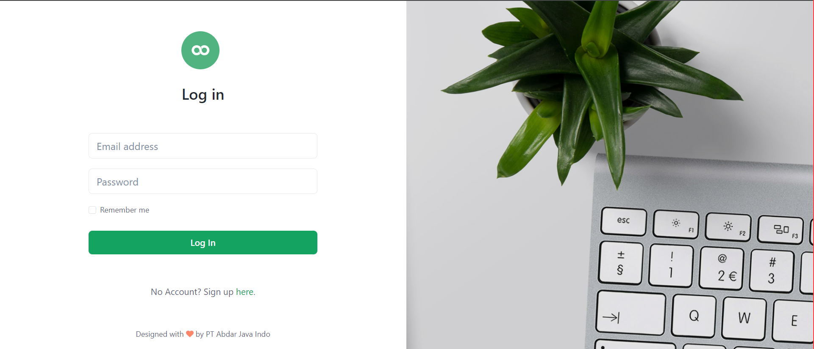
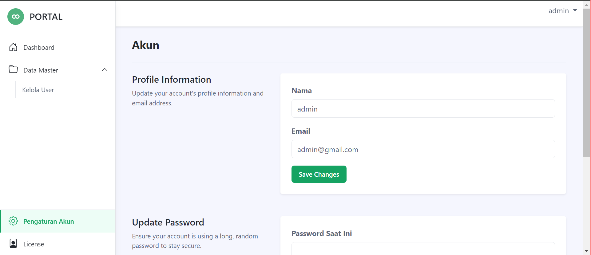

<p align="center"><a href="https://laravel.com" target="_blank"></a></p>

## Laravel Starter Kit

**Laravel Starter Kit** adalah sebuah starter project sederhana menggunakan framework Laravel 10. Website ini dibuat dengan menggunakan `Laravel Breze` dan `Portal Theme Bootstrap 5`.

<p align="center">
    
    
</p>

## Default Credential

```
User: user@gmail.com
Pass: password

User: admin@gmail.com
Pass: password

```

## Prerequisites

-   PHP 8.1
-   Node 14.16
-   Composer 2.7

## Installation

1. Download or clone project
2. Go to the folder application using cd
3. Run `composer install` on your cmd or terminal
4. Copy .env.example file to .env on root folder. You can type `copy .env.example .env` if using command prompt Windows or `cp .env.example .env` if using terminal Ubuntu
5. Open your .env file and change the database name (DB_DATABASE)
6. Run `php artisan key:generate`
7. Clear your config cache

```
 php artisan optimize:clear
 # or
 php artisan config:clear
```

8. Run `php artisan migrate --seed`
9. To create a link from the storage directory, run the following command from the project root:

```
php artisan storage:link
```

10. Run `php artisan serve` to running your app in browser

_After creating the new permissions use the following commands to update cashed permissions (optional)._

`php artisan cache:forget spatie.permission.cache`
